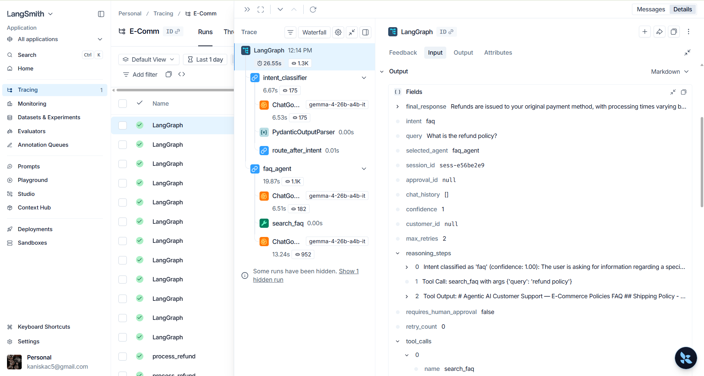

# Agentic AI Customer Support System

> **Local-first, production-quality Agentic AI support platform built with LangGraph, FastAPI, Streamlit, and SQLite.**

---

## System Showcase

### FAQ Resolution


### Order Tracking


### Refund Processing (Auto-Approved)


### Refund Processing (Human in Loop)


### LangSmith Tracing


---

## Architecture

```
Customer Query
      ↓
Streamlit Frontend (port 8501)
      ↓
FastAPI Backend (port 8000)
      ↓
LangGraph Orchestrator
      ↓
Intent Classification
      ├── Order Tracking Agent
      ├── Refund Processing Agent
      ├── FAQ Agent
      └── Human Escalation Agent
                  ↓
          Guardrails Layer
                  ↓
     Human Approval Workflow
                  ↓
   SQLite + LangSmith Logging
                  ↓
         Final Response
```

## Tech Stack

| Layer | Technology |
|---|---|
| Language | Python 3.12 |
| Package Manager | `uv` |
| Backend | FastAPI |
| Frontend | Streamlit |
| AI Orchestration | LangGraph |
| LLM | Gemini (`gemma-4-26b-a4b-it`) |
| Database | SQLite + SQLAlchemy |
| Tracing | LangSmith |
| Validation | Pydantic |

## Quick Start

### 1. Prerequisites

- Python 3.12+
- `uv` (installed automatically — see below)

### 2. Install `uv`

```powershell
# Windows (PowerShell)
powershell -ExecutionPolicy ByPass -c "irm https://astral.sh/uv/install.ps1 | iex"
```

### 3. Clone & Setup

```bash
git clone <repo-url>
cd E-Comm

# Install all dependencies
uv sync

# Copy environment template
cp .env.example .env
# Edit .env — add your GOOGLE_API_KEY and LANGSMITH keys
```

### 4. Run the Backend

```bash
uv run uvicorn backend.main:app --reload --host 0.0.0.0 --port 8000
```

### 5. Run the Frontend

```bash
uv run streamlit run frontend/streamlit_app.py
```

### 6. Open

- **Chat UI**: http://localhost:8501
- **API Docs**: http://localhost:8000/docs
- **Health Check**: http://localhost:8000/health

## Environment Variables

See `.env.example` for all required variables. Key ones:

| Variable | Description |
|---|---|
| `GOOGLE_API_KEY` | Gemini API key |
| `LLM_MODEL` | Model name (default: `gemma-4-26b-a4b-it`) |
| `LANGCHAIN_TRACING_V2` | Enable LangSmith tracing |
| `LANGCHAIN_API_KEY` | LangSmith API key |
| `REFUND_AUTO_APPROVE_LIMIT` | Max auto-approved refund in Rs (default: 1000) |

## API Endpoints

| Method | Path | Description |
|---|---|---|
| GET | `/health` | Liveness probe |
| POST | `/api/v1/chat` | Send a customer query |
| POST | `/api/v1/refund` | Process refund request |
| GET | `/api/v1/orders/{id}` | Get order details |
| GET | `/api/v1/approvals` | List pending approvals |
| POST | `/api/v1/approvals/{id}/approve` | Approve a pending action |
| POST | `/api/v1/approvals/{id}/reject` | Reject a pending action |
| GET | `/api/v1/logs` | Audit log stream |

## Troubleshooting

**`uv` not found after install**
```powershell
$env:Path = "C:\Users\<your-user>\.local\bin;$env:Path"
```

**LLM not responding**
- Check `GOOGLE_API_KEY` in `.env`
- Confirm model `gemma-4-26b-a4b-it` is available in your region

**Database errors**
- Delete `support_ai.db` and restart -- it will be re-seeded automatically
